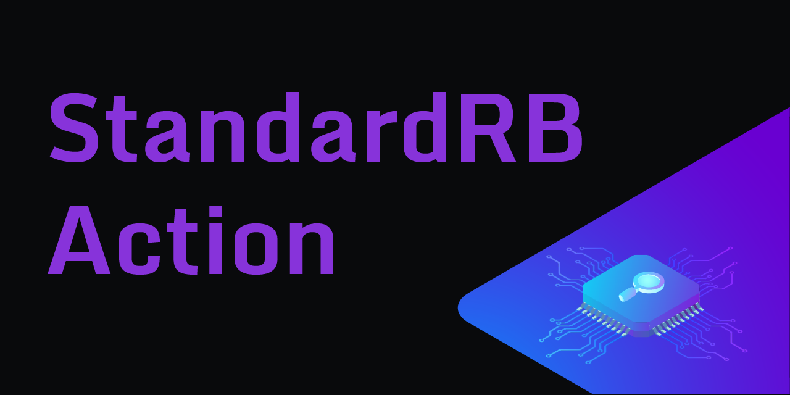
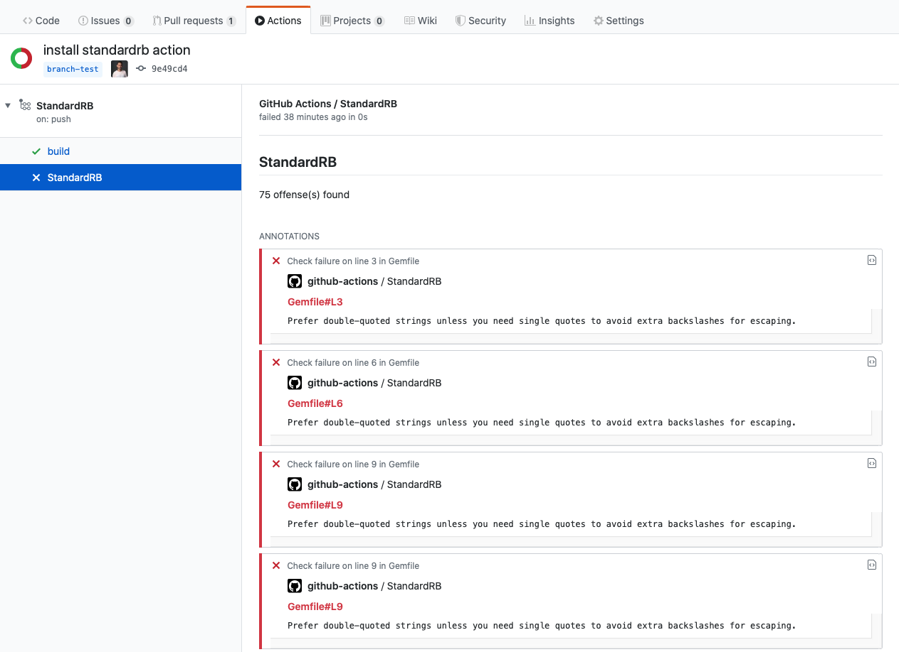
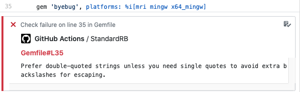

<div align="center">
  

  [](https://github.com/andrewmcodes/standardrb-action/actions/workflows/standard.yml)
  [](https://github.com/andrewmcodes/standardrb-action/actions/workflows/test.yml)
  [](https://github.com/andrewmcodes/standardrb-action/actions/workflows/build.yml)
  [](https://github.com/andrewmcodes/standardrb-action/actions/workflows/release.yml)
  
</div>

# :white_check_mark: StandardRB Action

A GitHub Action to run [StandardRB](https://github.com/testdouble/standard) against your code and create annotations in the GitHub UI.

## :page_facing_up: Introduction

GitHub Actions are an amazing new tool that can dramatically improve productivity while using the GitHub platform. While it is not hard to write a custom GitHub action to run StandardRB on your codebase, this action takes that functionality one step further using the checks API. After the StandardRB Linter Action runs StandardRB against your code, it will create annotations that you can easily view, matched up with the offending code.

Since GitHub actions and the checks API are continually changing, it is possible that there will be breaking API changes that affect this action. If so, please open an issue and I will look into it as soon as I can.

## :bulb: Usage

Add the following to your GitHub action workflow to use StandardRB Linter Action:

```yaml
- name: StandardRB Linter
  uses: andrewmcodes/standardrb-action@v1.0.0
  env:
    GITHUB_TOKEN: ${{ secrets.GITHUB_TOKEN }}
```

### :package: Example Workflow

Here is an example workflow file incorporating StandardRB Linter Action:

```yaml
name: StandardRB

on: [push]

jobs:
  build:
    runs-on: ubuntu-latest
    steps:
    - uses: actions/checkout@v1
    - name: StandardRB Linter
      uses: andrewmcodes/standardrb-action@v1.0.0
      env:
        GITHUB_TOKEN: ${{ secrets.GITHUB_TOKEN }}
```

## :warning: Gotchas

Due to the GitHub Check Runs API, we can only return 50 annotations per run. See [here](https://developer.github.com/v3/checks/runs/#output-object) for more info.

## :camera_flash: Screenshots




## :bookmark: Changelog

[View our Changelog](/CHANGELOG.md)

## :sos: Contributing

[Contributing Guide](/CONTRIBUTING.md)

## :rotating_light: Code of Conduct

[Code of Conduct](/CODE_OF_CONDUCT.md)

## :copyright: License

[MIT](/LICENSE.md)
